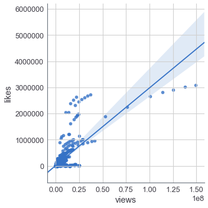
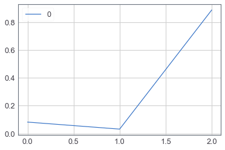
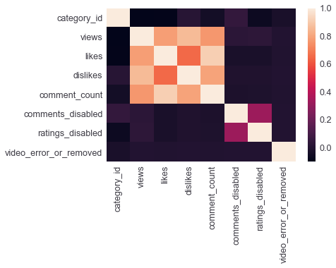

# Youtube Experiment - Regression Model

### Import the libraries


```python
# This Source Code Form is subject to the terms of the MIT
# License. If a copy of the same was not distributed with this
# file, You can obtain one at
# https://github.com/akhilpandey95/reproducibility/blob/master/LICENSE.

import numpy as np
import pandas as pd
import seaborn as sns
from tqdm import tqdm
import matplotlib.pyplot as plt
from sklearn.ensemble import RandomForestRegressor
from sklearn.cross_validation import train_test_split
from sklearn.metrics import mean_squared_error, r2_score

%matplotlib inline
```

### Read the dataset


```python
# read the dataset
rd = pd.read_csv('USvideos-with-transcripts.csv')
```

### Drop the rows with NaN


```python
# we are going to remove all the NaN's from dataset
rd = rd[rd.views != np.nan]

# drop na
rd.dropna(inplace=True)

# reset the index
rd = rd.reset_index(drop=True)

# print few rows
rd.head()
```


<div>
<style scoped>
    .dataframe tbody tr th:only-of-type {
        vertical-align: middle;
    }

    .dataframe tbody tr th {
        vertical-align: top;
    }

    .dataframe thead th {
        text-align: right;
    }
</style>
<table border="1" class="dataframe">
  <thead>
    <tr style="text-align: right;">
      <th></th>
      <th>Unnamed: 0</th>
      <th>video_id</th>
      <th>trending_date</th>
      <th>title</th>
      <th>channel_title</th>
      <th>category_id</th>
      <th>publish_time</th>
      <th>tags</th>
      <th>views</th>
      <th>likes</th>
      <th>dislikes</th>
      <th>comment_count</th>
      <th>thumbnail_link</th>
      <th>comments_disabled</th>
      <th>ratings_disabled</th>
      <th>video_error_or_removed</th>
      <th>description</th>
      <th>video_transcript_en</th>
    </tr>
  </thead>
  <tbody>
    <tr>
      <th>0</th>
      <td>0</td>
      <td>1ZAPwfrtAFY</td>
      <td>17.14.11</td>
      <td>The Trump Presidency: Last Week Tonight with J...</td>
      <td>LastWeekTonight</td>
      <td>24.0</td>
      <td>2017-11-13T07:30:00.000Z</td>
      <td>last week tonight trump presidency|"last week ...</td>
      <td>2418783.0</td>
      <td>97185.0</td>
      <td>6146.0</td>
      <td>12703.0</td>
      <td>https://i.ytimg.com/vi/1ZAPwfrtAFY/default.jpg</td>
      <td>0.0</td>
      <td>0.0</td>
      <td>0.0</td>
      <td>One year after the presidential election, John...</td>
      <td>&lt;?xml version="1.0" encoding="utf-8" ?&gt;&lt;transc...</td>
    </tr>
    <tr>
      <th>1</th>
      <td>1</td>
      <td>5qpjK5DgCt4</td>
      <td>17.14.11</td>
      <td>Racist Superman | Rudy Mancuso, King Bach &amp; Le...</td>
      <td>Rudy Mancuso</td>
      <td>23.0</td>
      <td>2017-11-12T19:05:24.000Z</td>
      <td>racist superman|"rudy"|"mancuso"|"king"|"bach"...</td>
      <td>3191434.0</td>
      <td>146033.0</td>
      <td>5339.0</td>
      <td>8181.0</td>
      <td>https://i.ytimg.com/vi/5qpjK5DgCt4/default.jpg</td>
      <td>0.0</td>
      <td>0.0</td>
      <td>0.0</td>
      <td>WATCH MY PREVIOUS VIDEO ▶ \n\nSUBSCRIBE ► http...</td>
      <td>&lt;?xml version="1.0" encoding="utf-8" ?&gt;&lt;transc...</td>
    </tr>
    <tr>
      <th>2</th>
      <td>2</td>
      <td>d380meD0W0M</td>
      <td>17.14.11</td>
      <td>I Dare You: GOING BALD!?</td>
      <td>nigahiga</td>
      <td>24.0</td>
      <td>2017-11-12T18:01:41.000Z</td>
      <td>ryan|"higa"|"higatv"|"nigahiga"|"i dare you"|"...</td>
      <td>2095731.0</td>
      <td>132235.0</td>
      <td>1989.0</td>
      <td>17518.0</td>
      <td>https://i.ytimg.com/vi/d380meD0W0M/default.jpg</td>
      <td>0.0</td>
      <td>0.0</td>
      <td>0.0</td>
      <td>I know it's been a while since we did this sho...</td>
      <td>&lt;?xml version="1.0" encoding="utf-8" ?&gt;&lt;transc...</td>
    </tr>
    <tr>
      <th>3</th>
      <td>3</td>
      <td>gHZ1Qz0KiKM</td>
      <td>17.14.11</td>
      <td>2 Weeks with iPhone X</td>
      <td>iJustine</td>
      <td>28.0</td>
      <td>2017-11-13T19:07:23.000Z</td>
      <td>ijustine|"week with iPhone X"|"iphone x"|"appl...</td>
      <td>119180.0</td>
      <td>9763.0</td>
      <td>511.0</td>
      <td>1434.0</td>
      <td>https://i.ytimg.com/vi/gHZ1Qz0KiKM/default.jpg</td>
      <td>0.0</td>
      <td>0.0</td>
      <td>0.0</td>
      <td>Using the iPhone for the past two weeks -- her...</td>
      <td>&lt;?xml version="1.0" encoding="utf-8" ?&gt;&lt;transc...</td>
    </tr>
    <tr>
      <th>4</th>
      <td>4</td>
      <td>nc99ccSXST0</td>
      <td>17.14.11</td>
      <td>5 Ice Cream Gadgets put to the Test</td>
      <td>CrazyRussianHacker</td>
      <td>28.0</td>
      <td>2017-11-12T21:50:37.000Z</td>
      <td>5 Ice Cream Gadgets|"Ice Cream"|"Cream Sandwic...</td>
      <td>817732.0</td>
      <td>23663.0</td>
      <td>778.0</td>
      <td>3432.0</td>
      <td>https://i.ytimg.com/vi/nc99ccSXST0/default.jpg</td>
      <td>0.0</td>
      <td>0.0</td>
      <td>0.0</td>
      <td>Ice Cream Pint Combination Lock - http://amzn....</td>
      <td>&lt;?xml version="1.0" encoding="utf-8" ?&gt;&lt;transc...</td>
    </tr>
  </tbody>
</table>
</div>


### Test train split


```python
# train test
y = rd.likes
x = rd.drop(['Unnamed: 0', 'video_transcript_en' , 'ratings_disabled', 'comments_disabled', 'video_error_or_removed', 'thumbnail_link', 'description', 'publish_time', 'tags', 'category_id', 'channel_title', 'video_id', 'trending_date', 'likes', 'title', 'Unnamed: 0'], axis=1)

# reset the index
x = x.reset_index(drop=True)

# split
x_train, x_test, y_train, y_test = train_test_split(x, y, test_size=0.2, random_state=1)
```

### Visualize the dataset


```python
sns.lmplot(x='views', y='likes', data=rd)
```


    <seaborn.axisgrid.FacetGrid at 0x10cc9db70>





### Build the regression Model


```python
# random forest regression
rfc = RandomForestRegressor(n_estimators=20, min_samples_split=4)
rfc.fit(x_train, y_train)
```


    RandomForestRegressor(bootstrap=True, criterion='mse', max_depth=None,
               max_features='auto', max_leaf_nodes=None,
               min_impurity_decrease=0.0, min_impurity_split=None,
               min_samples_leaf=1, min_samples_split=4,
               min_weight_fraction_leaf=0.0, n_estimators=20, n_jobs=1,
               oob_score=False, random_state=None, verbose=0, warm_start=False)


### Metrics for evaluating the model


```python
pred = rfc.predict(x_test)

# r-squared and mse
r2 = r2_score(y_test, pred)
mse = mean_squared_error(y_test, pred)

print("mse: %0.3f" % mse)
print("r-squared: %0.3f" % r2)
print("feature-importances:", rfc.feature_importances_)

# convert the feature_importance to a matrix
fi = pd.DataFrame(rfc.feature_importances_)
fi.plot()
plt.show()

# visualize the correlation
corr = rd.corr()
sns.heatmap(corr,xticklabels=corr.columns.values,yticklabels=corr.columns.values)
```

    mse: 2240898810.320
    r-squared: 0.899
    feature-importances: [0.08192171 0.03157173 0.88650656]





    <matplotlib.axes._subplots.AxesSubplot at 0x10ea4deb8>




